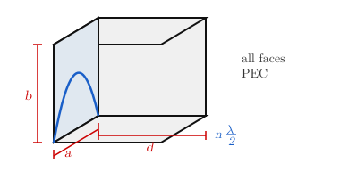

# Cavities

In certain cases high field selectivity is required. Various types of resonators can be used for this purpose.

## Series and Parallel RLC Resonators

A series RLC resonator has impedance $Z_{in} = R + j\omega L + \frac{1}{j\omega C}$. $LC$ determines $\omega_0$, $R$ determines the dissipation factor.

{width="20%"}

$$Z_{in} \big|_{\omega_0},\ Z_{in} \in \mathbb{R}$$

At resonance, $W_m$ and $W_e$ will be equal and resonate between one form and the other:

$$\omega_0^2 = \frac{1}{LC}$$

$$W_m = \frac{1}{2} L \bar{I}^2, \qquad W_e = \frac{1}{2} C V^2$$

For the parallel RLC resonator ($Y_{in} \big|_{\omega_0},\ Y_{in} \in \mathbb{R}$, $\omega_0 = \frac{1}{\sqrt{LC}}$):

{width="50%"}

The resistive/dissipative elements affect the bandwidth, due to parasitics of $L$ and $C$. But there might be other dissipative factors.

## Cavity — Electromagnetic Bulk Resonator

e.g. a section of WR-90, PEC terminated at both ends — all faces of the prism are PEC.

{width="60%"}

WR-90: $a = 0.9''$, $b = 0.4''$ $\Rightarrow$ $\text{TE}_{10}$ mode, for $\omega > \omega_{c_{10}}$.

$d = ?$ $\rightarrow$ for resonance: $d = p\dfrac{\lambda}{2}$, giving modes $\text{TE}_{10p}$ (generally $\text{TE}_{nmp}$).

$\therefore$ $\omega_{nmp}$ are discrete frequencies.

**Q factor:**

$$Q = \frac{W_s}{P_d} \cdot \omega_0 = \frac{\omega_0}{\Delta\omega}$$

e.g. **cavity wavemeter** (cylindrical waveguide) — $d$ is tunable.

e.g. **dielectric resonator oscillator (DRO)** — small disc of high $\varepsilon_r$ material ($\varepsilon_r \sim 100$). No PEC, all dielectric. The field $|E|$ is confined inside the disc and decays rapidly with radius $r$.

## Field Analysis

We will consider a PEC wall RWG. Nevertheless this analysis method is applicable to any type. Consider a WG section with cross section dimensions $a$, $b$.

For $\text{TE}_{nm}$ modes, the fields are:

$$H_{z,nm} = A_{nm} \cos\!\left(\frac{n\pi}{a}x\right)\cos\!\left(\frac{m\pi}{b}y\right) e^{\mp j\beta_{nm} z}$$

where $+z$ is forward propagation and $-z$ is backward propagation.

$$H_{x,nm} = \mp j\,\frac{\beta_{nm}}{k_{c_{nm}}^2}\cdot A_{nm}\frac{n\pi}{a}\sin\!\left(\frac{n\pi}{a}x\right)\cos\!\left(\frac{m\pi}{b}y\right)e^{\mp j\beta_{nm}z}$$

$$H_{y,nm} = \mp j\,\frac{\beta_{nm}}{k_{c_{nm}}^2}\cdot A_{nm}\frac{m\pi}{b}\cos\!\left(\frac{n\pi}{a}x\right)\sin\!\left(\frac{m\pi}{b}y\right)e^{\mp j\beta_{nm}z}$$

The dominant mode is $\text{TE}_{10}$:

$$H_{z,10} = A_{10}\cos\!\left(\frac{\pi}{a}x\right)e^{\mp j\beta_{10}z}$$

In the cavity there will be $+$ and $-$ propagating waves:

$$H_z = H_1\cos\!\left(\frac{\pi}{a}x\right)e^{+j\beta_{10}z} + H_2\cos\!\left(\frac{\pi}{a}x\right)e^{-j\beta_{10}z}$$

$$H_y = 0$$

$$H_x = j\frac{\beta_{10}}{k_{c_{10}}^2}\cdot\frac{\pi}{a}\left(H_1 e^{+j\beta_{10}z} - H_2\, e^{-j\beta_{10}z}\right)\sin\!\left(\frac{\pi}{a}x\right)$$

$$k_{c_{10}} = \frac{\pi}{a}$$

The wave impedance relation gives:

$$\frac{E_y}{H_x} = -Z_{\text{TE}} = -\frac{k}{\beta}\,Z_0$$

$$E_y = -jk_0\,\frac{1}{\pi/a}\,Z_0\left(H_1 e^{+j\beta_{10}z} + H_2 e^{-j\beta_{10}z}\right)$$

$H_1$ and $H_2$ are unknowns.

Consider a section of length $d$ of this waveguide. At $z=0$ and $z=d$, PEC boundary conditions must be satisfied:

$$E_y(z=0) = 0, \qquad E_y(z=d) = 0 \quad \Rightarrow \text{ equivalent conditions}$$

$$\hat{a}_n \times \mathbf{H}\big|_{z=0} = 0, \qquad \hat{a}_n \times \mathbf{H}\big|_{z=d} = 0 \Rightarrow \text{ equivalent conditions}$$

**At** $z=0$: $\hat{a}_n = +\hat{a}_z$

$$\hat{a}_n \cdot \bar{M} = H_z = 0$$

$$H_z(z=0) = H_1 + H_2 = 0 \quad \Rightarrow \quad H_1 = -H_2$$

**At** $z=d$: $\hat{a}_n = -\hat{a}_z$

$$\hat{a}_n \cdot \mathbf{H} = -H_z$$

$$H_1\, e^{+j\beta_{10}d} + H_2\, e^{-j\beta_{10}d} = 0$$

$$H_1\!\left(e^{+j\beta_{10}d} - e^{-j\beta_{10}d}\right) = 0$$

$$-2j\,H_1\sin\beta_{10}d = 0 \quad \Rightarrow \quad \beta_{10}d = p\pi, \quad p = 1, 2, 3, \ldots$$

Since $\beta = \dfrac{2\pi}{\lambda_g}$:

$$\frac{2\pi}{\lambda_g} \cdot d = p\pi \quad \Rightarrow \quad \boxed{d = p\,\frac{\lambda_g}{2}} \quad \text{(resonance condition)}$$

From the dispersion relation $\beta^2 = k^2 - k_c^2$:

$$\beta_{nm}^2 = \omega^2\mu_0\varepsilon_0 - \left(\frac{n\pi}{a}\right)^2 - \left(\frac{m\pi}{b}\right)^2 = \left(\frac{p\pi}{d}\right)^2$$

Setting $\beta_{nm} = p\pi/d$ and solving for the resonant frequency:

$$\omega_0^2\mu_0\varepsilon_0 = \left(\frac{n\pi}{a}\right)^2 + \left(\frac{m\pi}{b}\right)^2 + \left(\frac{p\pi}{d}\right)^2 \quad \Rightarrow \quad \omega_{nmp} \; !$$

Convention: $d > a > b$, so $\text{TE}_{101}$ is the dominant mode — the lowest resonant frequency for a PEC RWG cavity.

The discrete resonant frequencies $\omega_{101} < \omega_{nmp} < \cdots$ are shown below as a spectrum on the $\omega$ axis.

{width=70%}

> **Note:** Swapping $a$, $b$, $d$ changes nothing physically — only the labelling of modes.